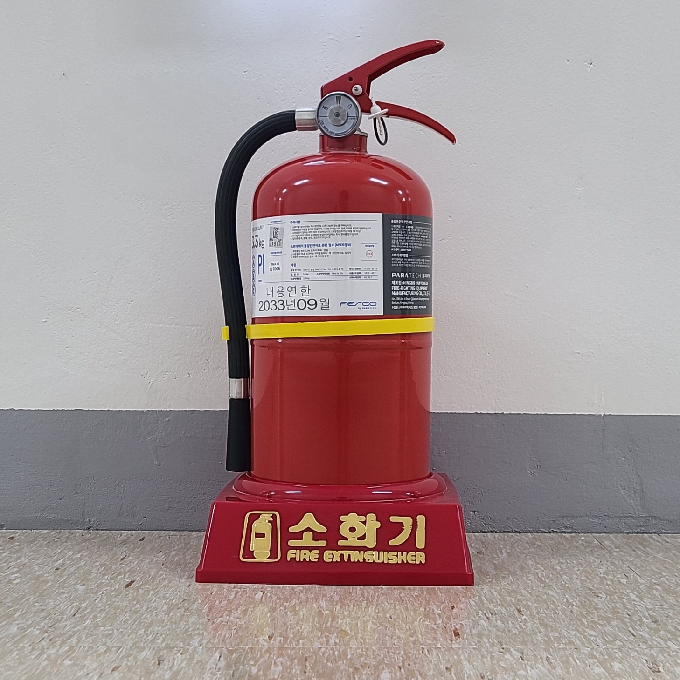
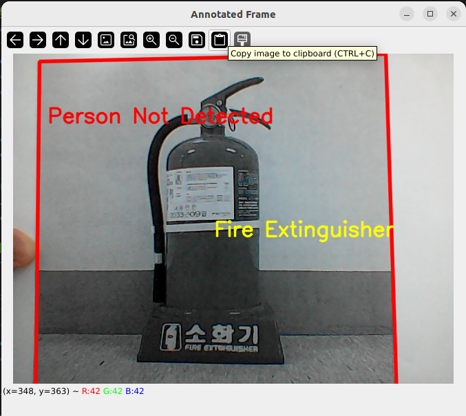
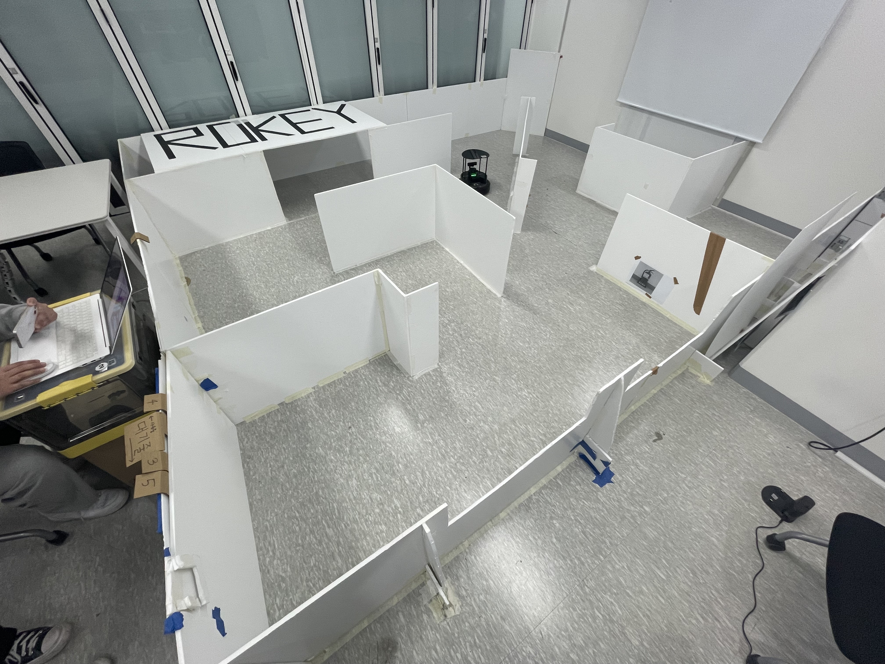

# Disaster Bot Project

## Overview
ROS2 환경에서 Turtlebot4 카메라로부터 이미지를 받아 실시간으로 객체(소화기와 사람)를 탐지하고, 해당 객체의 위치를 추정하여 ROS Marker로 퍼블리시하는 프로그램입니다. 소화기, 사람의 이미지를 ORB 알고리즘을 사용하여 특징점, 디스크림터를 추출한 후, 터틀봇4 카메라의 실시간 이미지를 마찬가지로  ORB 알고리즘을 사용하여 특징점, 디스크림터를 추출한 후 앞서 추출한 이미지의 특징점과 매칭하며, 매칭점이 5개 이상이면 객체인식한 걸로 판단하여 OpenCV를 통해 시각적인 결과를 표시합니다. 호모그래피, FLANN 매처, PnP알고리즘을 사용하여 이미지의 위치를 추정하며 RVIZ에서 marker를 추가하면 이미지(소화기, 사람)의 위치를 확인할 수 있습니다.

또한 SLAM 후 map 저장 과정 없이 auto-mapping 을 위해 yaml 파일의 파라미터들을 조정하였습니다.

## Capture

### Images
<p align="center">
  
  
</p>

### ORB알고리즘으로 실시간 이미지와 특징점 매칭한 모습
<p align="center">
  
</p>

### 실내 SLAM 주행장 모습
<p align="center">
  
</p>


## Project Demo
[turtlebot4 automapping video](capture/ttb4_automapping_navigation.mp4)

[ttb4_automapping_in_rviz_video](capture/ttb4_automapping_navigation_rviz_short_480p.mp4)

[image recoognition and displaying location markers in rviz2 video](capture/demo.gif)

How to execute test
===============================
A4용지에 프린트된 소화기나 사람의 이미지를 노트뷱의 웹캠 앞에 위치시켜 객체인식 여부를 테스트할 수 있습니다.
```console
rviz2
ros2 run disaster_bot test
```

How to execute real
===============================
터틀봇4 SLAM 을 수행하는 중에 터틀봇4 카메라로 ORB알고리즘으로 이미지와 특징점 매칭후 호모그래피 - PnP알고리즘을 통해 위치를 추정합니다.
```console
rviz2
ros2 run disaster_bot dibot
```

How to execute launch file
=============================
yaml 파일 적용하여 auto-mapping 론치 파일 실행하기
```console
ros2 launch disaster_bot auto_mapping_launch.py
```

