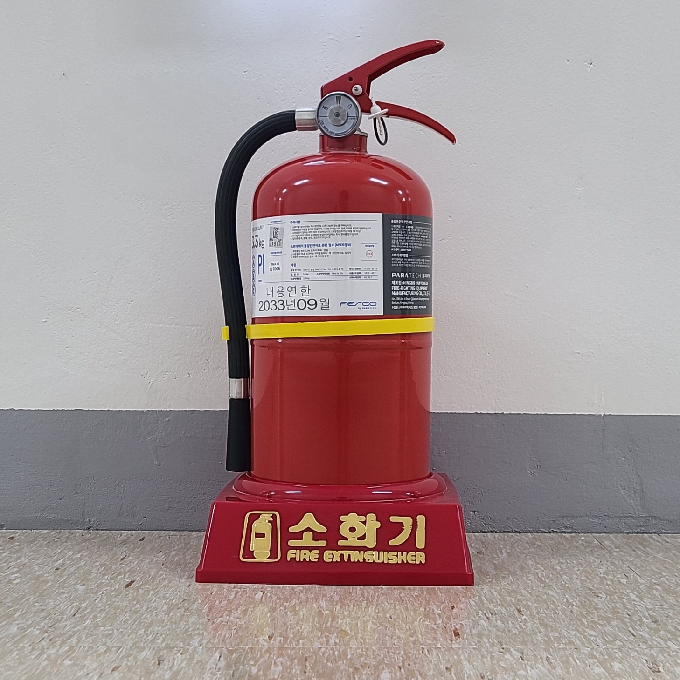

# Disaster Bot Project

## Overview
ROS2 환경에서 Turtlebot4 카메라로부터 이미지를 받아 실시간으로 객체(소화기와 사람)를 탐지하고, 해당 객체의 위치를 추정하여 ROS Marker로 퍼블리시하는 프로그램입니다. ORB 알고리즘을 사용하여 특징점을 추출하고 매칭하며, OpenCV를 통해 시각적인 결과를 표시합니다. 멀티스레딩과 스레드 동기화를 사용하여 안정적인 GUI 처리를 구현하였습니다. RVIZ에서 marker를 추가하면 이미지(소화기, 사람)의 위치를 확인할 수 있습니다.

## Capture
<p align="center">
  
  
</p>

<p align="center">
  
</p>

<p align="center">
  
</p>


## Project Demo
[turtlebot4 automapping video](capture/ttb4_automapping_navigation.mp4)

[ttb4_automapping_in_rviz_video](capture/ttb4_automapping_navigation_rviz_short_480p.mp4)

[image recoognition and displaying location markers in rviz2 video](capture/demo.gif)

How to execute test
===============================
```console
rviz2
ros2 run disaster_bot test
```

How to execute real
===============================
```console
rviz2
ros2 run disaster_bot dibot
```

